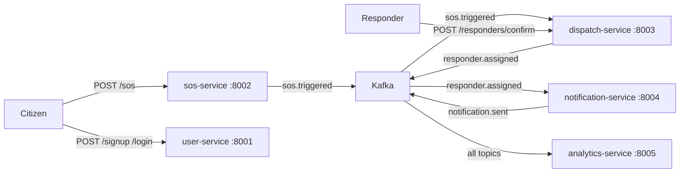

# L4 Design Process Document — HELEP

> Marks rest on **traceability**: every architectural choice traces back to a requirement, driver, or constraint from the SRS.

---

## 1. Project Specification

HELEP (Help Emergency Location Platform) is a real-time emergency response system for Cameroon. When a citizen triggers an SOS, the platform captures their GPS location, assigns the nearest available responder (police/ambulance), delivers an SMS/push notification, and logs the incident for analytics. The system eliminates coordination delays that cost lives in manual dispatch workflows.

**Primary users:** (1) **Citizens** — trigger SOS, cancel false alarms; (2) **Responders** — receive dispatch assignments, confirm en-route status; (3) **Police/Analysts** — view incident heatmaps and zone statistics; (4) **Admins** — manage responder profiles and danger zones.

**Business value:** Sub-second SOS-to-notification latency, guaranteed single-responder assignment per incident, and auditable incident logs for post-event review.

---

## 2. Requirements Analysis

### 2.1 Functional Requirements (SRS §2)

| # | Requirement | SRS §2 Source |
|---|-------------|---------------|
| F1 | Citizens register with phone, password, and role | User Management |
| F2 | Citizens trigger SOS with GPS coordinates and mode (online/offline) | Emergency Component |
| F3 | Citizens can cancel an active SOS | Emergency Component |
| F4 | System assigns exactly one available responder per incident | Incident Response |
| F5 | Dispatcher uses configurable matching strategy (nearest / credibility / round-robin) | Localization |
| F6 | Notify assigned responder via SMS/push (simulated) | Alert Management |
| F7 | Notify nearby citizens when SOS is in a registered danger zone | Alert Management |
| F8 | Responder confirms en-route status | Incident Response |
| F9 | Analytics service exposes event counts and zone heatmaps | Analytics & Statistics |
| F10 | All service state survives pod restarts (persistent storage) | Portability NFR |

### 2.2 Non-Functional Requirements (SRS §3)

| NFR | Measurable Acceptance Criterion |
|-----|---------------------------------|
| **Availability** | All 5 services maintain ≥ 99.5% uptime; K8s HPA maintains min 2 replicas, recovering from single-pod failure in < 30 s |
| **Reliability** | 100% of SOS events produce exactly one `responder.assigned` event; at-least-once Kafka delivery + idempotent handlers ensure no events are lost |
| **Scalability** | System sustains 100 concurrent SOS events/s; HPA scales services to max 5 replicas under 70% CPU utilisation |
| **Confidentiality** | JWT tokens required on all citizen/responder endpoints; `JWT_SECRET` stored in K8s Secret; NetworkPolicy enforces default-deny |
| **Integrity** | No double-dispatch: atomic `UPDATE … WHERE busy=0` in `dispatch-service/app/db.py` guarantees single-responder assignment |
| **Usability** | All REST endpoints return structured JSON; median response latency < 200 ms at 50 req/s |
| **Compatibility** | Services run on any OCI-compliant runtime; Helm chart deploys to any CNCF-certified K8s cluster |

### 2.3 Constraints (SRS §4)

| Constraint | Architectural Risk |
|------------|-------------------|
| **Single response at any moment** — one responder per incident | Race condition risk in multi-replica `dispatch-service`; mitigated by atomic SQLite `UPDATE … WHERE busy=0` (see `dispatch-service/app/db.py`) |
| **Trigger → notify < 1 second** | Synchronous HTTP chains would violate this; mitigated by async Kafka event flow with small JSON payloads and no inter-service HTTP |

---

## 3. Architectural Drivers & ASRs

The three most architecturally significant requirements are:

### ASR-1: Reliability (SRS §3 — "no double dispatch")
- **Quality attribute:** Reliability / Integrity
- **Why significant:** A double-dispatched incident wastes a responder and may leave another incident unattended, causing harm. This single constraint shapes the entire dispatch data model (atomic SQLite claim, Kafka partition keying by `incident_id`).
- **Mechanism:** `reserve_responder_for()` in `dispatch-service/app/db.py` uses `UPDATE responders SET busy=1 WHERE id=? AND busy=0` — only one concurrent writer can win; the rest retry on the next Kafka poll.

### ASR-2: Availability (SRS §3 — survive pod failures)
- **Quality attribute:** Availability
- **Why significant:** Emergency response cannot tolerate downtime. This drives multi-replica Deployments, HPA, K8s liveness/readiness probes, and consumer-group semantics so a replacement pod resumes from the last committed Kafka offset.
- **Mechanism:** `enable_auto_commit=False` + manual `await consumer.commit()` only after successful handler (see `events.py:112`).

### ASR-3: Scalability (SRS §3 — 100 req/s)
- **Quality attribute:** Scalability / Performance
- **Why significant:** Urban emergency peaks (e.g., stadium events) can spike SOS volume 10×. Stateless FastAPI services + Kafka consumer groups allow horizontal scaling. Topic partitions keyed by `incident_id` ensure ordering per incident while enabling parallel consumer pods.
- **Mechanism:** Strimzi Kafka with 3 partitions per topic; each service pod consumes from its own group; HPA scales replicas up to 5.

---

## 4. Component Identification

### 4.1 SRS-Listed Components (8 total)

1. User Management
2. Emergency Component
3. Incident Report & Response
4. Localization
5. Alert Management
6. Alert Delivery
7. Feedback & Review
8. Analytics & Statistics

### 4.2 Service Decomposition (5 services)

| Service | SRS Components Merged | Justification |
|---------|----------------------|---------------|
| `user-service` | User Management | Pure identity domain; JWT issuance + bcrypt hashing isolated to prevent credential leakage across service boundaries. No merge possible — single responsibility. |
| `sos-service` | Emergency Component | Owns SOS lifecycle (trigger, cancel). Split from dispatch because *deciding to respond* (sos-service) and *who responds* (dispatch-service) are distinct bounded contexts. |
| `dispatch-service` | Incident Report & Response + Localization | Merged because haversine matching and assignment are inseparable — the match result is immediately written as an assignment row. Splitting would require a synchronous call, violating sub-1s constraint. |
| `notification-service` | Alert Management + Alert Delivery | Merged because the zone-detection decision (who gets notified) and the delivery simulation are tightly coupled with no reuse benefit from separation at this scale. |
| `analytics-service` | Analytics & Statistics | Pure read model — consumes all topics and aggregates counters. Isolated to protect operational services from analytics query load (Bulkhead pattern). |
| *(out of scope)* | Feedback & Review | Deferred — not required for core safety flow. Noted as bonus extension. |

---

## 5. Architectural Style — Choice & Justification

**Prescribed style:** Microservices + Event-Driven Architecture (EDA).

### Defence Against Monolith

A monolithic architecture could satisfy functional requirements but would **fail ASR-2 (Availability)** and **ASR-3 (Scalability)**:
- A single process cannot scale the SOS ingestion path independently from analytics.
- A failure in the analytics query layer (e.g., slow stats query) blocks SOS processing.
- **Dominant trade-off:** Monolith offers simpler deployment but sacrifices independent fault isolation and per-component scalability — both critical for emergency response.

### Defence Against SOA (Service-Oriented Architecture)

SOA with a central ESB (Enterprise Service Bus) could provide service separation but would **fail ASR-1 (Reliability)** and the sub-1s latency constraint:
- ESB introduces a single point of failure and a synchronous orchestration bottleneck.
- XML/SOAP message overhead adds latency incompatible with the < 1 s SOS-to-notify constraint.
- **Dominant trade-off:** SOA's central bus provides governance but destroys the decentralised resilience the HELEP saga requires.

### Why Microservices + EDA Wins

| NFR | How Microservices + EDA satisfies it |
|-----|--------------------------------------|
| Availability | Independent deployments; one service restart does not cascade |
| Reliability | At-least-once Kafka delivery + idempotent handlers (SRS §3) |
| Scalability | Stateless pods scale horizontally; Kafka partitions parallelize consumers |
| Confidentiality | NetworkPolicy default-deny; JWT validated per service (SRS §3) |
| Portability | OCI containers + Helm chart (SRS §3) |

---

## 6. Architectural Patterns Applied

*(Full citations in `patterns-template.md`)*

| Pattern | File | Problem Solved |
|---------|------|----------------|
| Choreographed Saga | `sos-service/app/main.py` → `dispatch-service/app/main.py` → `notification-service/app/main.py` | Coordinates multi-service SOS flow without a central orchestrator; compensation via `sos.cancelled` event |
| Pub/Sub (Kafka) | All `app/events.py` | Decouples producers from consumers; enables fan-out (one SOS event → dispatch + notification + analytics) |
| Repository | All `app/db.py` | Isolates SQLite queries from route handlers; enables unit testing without a running DB |
| Strategy | `dispatch-service/app/matching.py` | Pluggable responder selection (nearest, credibility, round-robin) switchable via `MATCHER` env var |
| Outbox-lite | `sos-service/app/main.py:trigger()` | DB insert + Kafka publish in same async block reduces dual-write inconsistency window |
| Circuit Breaker | All `app/events.py:CircuitBreaker` | Prevents cascade failure when Kafka broker is unreachable; CLOSED → OPEN → HALF_OPEN state machine |
| API Gateway (added) | `k8s/ingress.yaml` | NGINX Ingress rewrites `/api/{service}/*` paths; single external entry point hides internal service topology |
| Bulkhead (added) | Separate Kafka consumer groups per service | Isolates consumer failure — analytics consumer lag cannot starve dispatch consumer |

---

## 7. Architecture Decision Records

### ADR-001: Kafka Partition Keying by `incident_id`

**Context:** Each SOS incident produces multiple events (`sos.triggered` → `responder.assigned` → `notification.sent`). With 3 topic partitions and multiple consumer pod replicas, events for the same incident could land on different partitions and be processed out of order.

**Decision:** All saga-critical `publish()` calls pass `key=incident_id`. Kafka's default partitioner hashes the key, so all events for a given incident land on the same partition, which is owned by exactly one consumer pod within the group.

**Consequences:** Ordering is guaranteed per incident. Partition count (3) caps parallel consumer throughput to 3 pods per consumer group — acceptable for current scale. Adding partitions later requires a migration.

**Alternatives Considered:** Random partitioning — rejected because it destroys ordering and breaks the "no double dispatch" invariant when two `sos.triggered` events for the same incident are processed concurrently.

---

### ADR-002: SQLite per Service vs. Shared PostgreSQL

**Context:** Services need persistent state (users, SOS incidents, assignments, notifications, analytics counters). A shared relational database is the traditional choice.

**Decision:** SQLite per service, persisted to a PersistentVolumeClaim (`/data/*.db`). Each service owns its schema entirely.

**Consequences:** Zero network round-trips for DB queries (sub-millisecond reads). No DB connection pool management. Enforces bounded-context isolation — `dispatch-service` cannot join against `user-service` tables. Limitation: SQLite's single-writer model caps write throughput; a production upgrade would replace with PostgreSQL per service.

**Alternatives Considered:** Shared PostgreSQL — rejected because it creates a single point of failure, couples service schemas, and violates the microservice principle of independent deployability. Per-service PostgreSQL — correct long-term direction but over-engineered for a 24-hour build budget.

---

### ADR-003: Helm Umbrella Chart vs. Separate Charts

**Context:** 5 services need K8s manifests. Options: (a) raw manifests only, (b) one Helm chart per service, (c) Helm umbrella with sub-charts.

**Decision:** Helm umbrella chart (`helm/helep-chart/`) with 5 sub-charts and a shared `values.yaml`. A single `helm install helep helm/helep-chart/` deploys the entire platform.

**Consequences:** One-command install/upgrade for the entire platform. Global values (Kafka bootstrap, JWT secret) propagated to all sub-charts. Sub-charts can still be overridden individually. Slight complexity — `helm dependency update` required before install.

**Alternatives Considered:** Raw K8s manifests only — easier to understand but no parameterization, no rollback, no upgrade history. Separate charts per service — maximises independence but forces operators to run 5 separate `helm install` commands and manually synchronise shared configuration.

---

## 8. Trade-offs & Improvement Perspectives

### Weakness 1: SQLite Cannot Handle Multi-Replica Writes

**Problem:** SQLite uses file-level locking. With 2+ replicas of `dispatch-service` sharing a single PVC (ReadWriteOnce), concurrent writes to `dispatch.db` will serialise or deadlock under load. The HPA maxReplicas=5 makes this a real risk.

**Proposed Fix:** Replace SQLite with a per-service PostgreSQL StatefulSet (or managed RDS/Cloud SQL). The schema requires no changes — only the DB connection string. Alternatively, use PostgreSQL's `SELECT … FOR UPDATE SKIP LOCKED` for the responder reservation query.

### Weakness 2: Outbox-lite Is Not Crash-Safe

**Problem:** The "outbox-lite" pattern in `sos-service/app/main.py` writes to SQLite and *then* publishes to Kafka in the same async block — but if the process crashes between the two operations, the DB row exists but no event is published. The incident is silently lost.

**Proposed Fix:** Implement a proper Transactional Outbox: write the event to an `outbox` table in the same SQLite transaction as the SOS row. A background poller reads unpublished outbox rows, publishes them to Kafka, then marks them published. This guarantees at-least-once event delivery even across crashes.

### Weakness 3: No Authentication on Internal Service Endpoints

**Problem:** `/responders/confirm` (dispatch-service) and `/stats/*` (analytics-service) are unprotected. Any pod in the `helep` namespace can call them without a JWT. NetworkPolicy restricts external access but does not authenticate internal callers.

**Proposed Fix:** Issue service-to-service JWTs (machine tokens) signed with a dedicated secret, or adopt a service mesh (Istio/Linkerd) for mutual TLS (mTLS) between pods. mTLS provides cryptographic identity without application-level code changes.

---

## 9. Submission Checklist

- [x] Every section above completed
- [x] At least 3 diagrams (Mermaid in §4 + saga sequence in `architecture-overview.md`)
- [x] Every choice traced to an SRS line, an NFR, or an ASR
- [x] 3 ADRs included (ADR-001, ADR-002, ADR-003)
- [x] Word count ≈ 2,500 words
